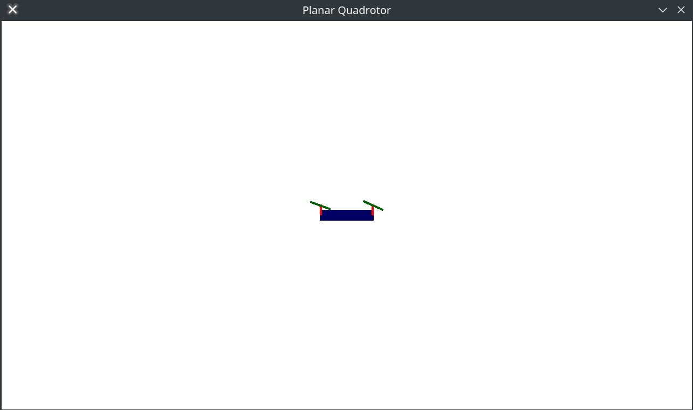

# Techniki Programowania - Projekt 4 Oddanie

## Zrealizowanie elementy

1. Przyporządkowanie odpowiednich wartości do macierzy Q i R
2. Wyskalowanie współrzędnych
3. Wykresy trajektorii lotu drona (p- współrzędne 'x' i 'y' t - 'θ')
4. Wyświetlanie drona
5. Animacja kątu theta
6. Animacja obrotu śmigieł
7. Dźwięk drona

## Macierze Q i R

### Dopasowane wartości

```
Q.diagonal() << 5e-3, 5e-3, 1e3, 2*5e-2, 5e-2, 1/M_PI;
R.row(0) << 3e1, 5;
R.row(1) << 5, 3e1;
```

W macierzy kontrolera LQR macierz Q reprezentuje koszty związane ze stanem systemu, a macierz R reprezentuje koszty związane z wejściami. Macierze te określają, jak bardzo chcemy minimalizować odchylenia od pożądanego stanu oraz jak bardzo chcemy ograniczyć zużycie energii.

#### Macierz Q

Elementy macierzy Q na diagonalnej reprezentują wagi przypisane do odpowiednich stanów:
    5e-3 dla x: Niska wartość, kontroler będzie mniej agresywny w korygowaniu błędów w osi X.
    5e-3 dla y: Niska wartość, kontroler będzie mniej agresywny w korygowaniu błędów w osi Y.
    1e3 dla θ: Bardzo wysoka wartość oznacza, kontroler będzie bardzo agresywnie minimalizował jego odchylenia. Jest to ważne dla stabilności drona.
    2*5e-2 dla x˙: Umiarkowana wartość kontroler będzie mniej agresywny w korygowaniu błędów dla prędkości w osi X.
    5e-2 dla y˙​: Umiarkowana wartość kontroler będzie mniej agresywny w korygowaniu błędów dla prędkości w osi Y.
    1/M_PI dla θ˙: Umiarkowana waga dla prędkości kątowej. Kontroler będzie umiarkowanie dążył do stabilizacji prędkości kątowej.

#### Macierz R

Pierwszy wiersz R:
    Wartość 30 dla pierwszego sygnału: Kontroler stara się go używać mniej.
    Wartość 5 dla drugiego sygnału: Kontroler może go używać częściej.

 Drugi wiersz R:
    Wartość 5 dla pierwszego sygnału: Kontroler może go używać częściej.
    Wartość 30 dla drugiego sygnału: Kontroler stara się go używać mniej.

## Animacja obrotu śmigieł

```
SDL_Rect proppeler; # tworzenie obiektu
drawRect (&proppeler, x, y, 40, 4); # rysowanie prostokątu w funkcji

SDL_Surface* surface = SDL_CreateRGBSurface(0, 40, 4, 32, 0, 0, 0, 0); # tworzenie powierzchni o wymiarach prostokąta
SDL_FillRect(surface, nullptr, SDL_MapRGB(surface->format, 0, 100, 0)); # wypełnienie i kolor

SDL_Texture* texture = SDL_CreateTextureFromSurface(gRenderer.get(), surface); # tworzenie tekstury na bazie powierzchni

rotation += 4; # zmiana kąta obrotu funckja wywoływana jest w pętli, zmienna rotation jest prywatnym członkiem klasy

SDL_RenderCopyEx(gRenderer.get(), texture, NULL, &proppeler, rotation, NULL, SDL_FLIP_NONE); # rysowanie
SDL_FreeSurface(surface); # zwolnienie pamięci
SDL_DestroyTexture(texture);
```

## Dźwięk

```
Mix_Chunk* sound = Mix_LoadWAV("../PlanarQuadrotor/s.wav"); # wczytanie pliku dźwiękowego
if (sound == nullptr) {
std::cout << "Failed to load sound! SDL_mixer Error: " << Mix_GetError() << std::endl; # wykrywanie błędów
return 1;
}
int channel = Mix_PlayChannel(-1, sound, -1); # odtwarzanie dźwięku w nieskończonej pętli
```

```
Mix_Volume(channel, (quadrotor.GetInput().norm())/ 2 * MIX_MAX_VOLUME); # zmiana dźwięku na podstawie wektora 
```

## Wygląd aplikacji



## Projekt wykonali

Szymon Kowalski 198055,
Sebastaian Kuczera 198118
